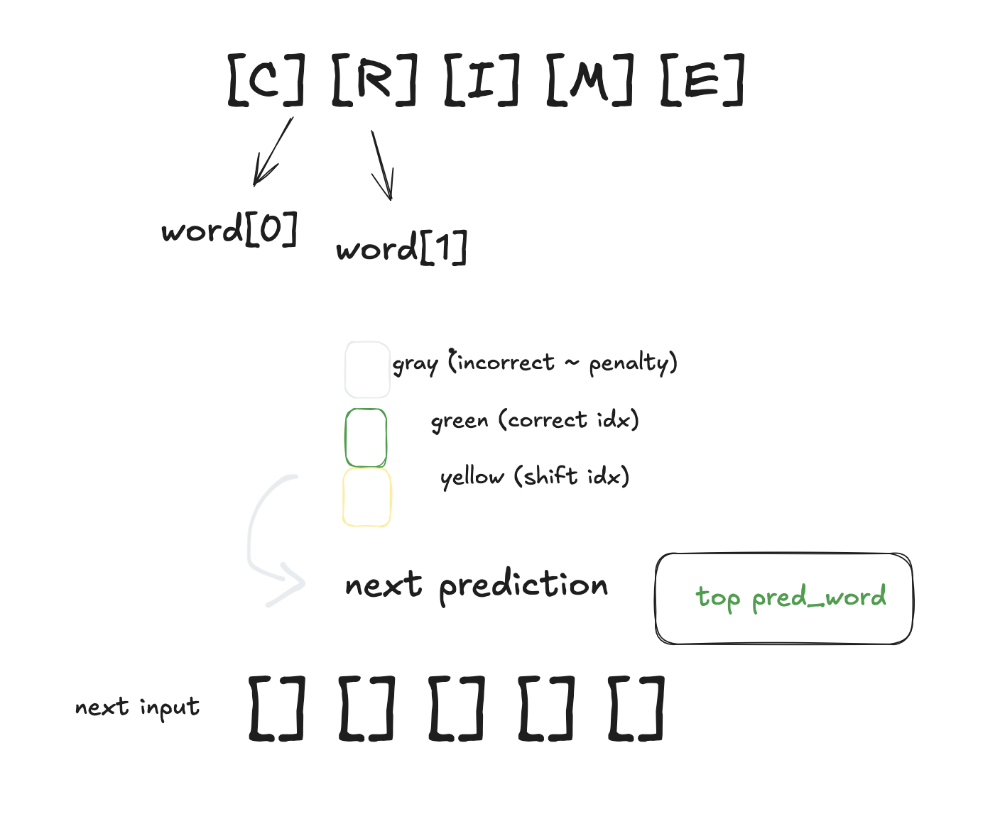

[Link]()

Thoughts:

get all words.txt -> english alphabet.
start with uniform pd of all words.

for each guess:
- incosistent with feedback : eliminated 
- consistent more likely to be target (keep a score? penalty?)
- update word list and probabilites (+ wordfreq to keep top k guesses for next)
    - score = entropy * probability 

goal : maximise information guess from each guess + reduce entropy {eliminate incorr words}

